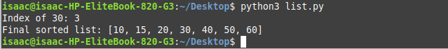

# PLP-Week2Python-List
This repository is part of an assignment submitted to PowerLearnProject as part of an assignment for Python Module.

# List Operations in Python

This repository contains a Python script demonstrating various list operations. It walks through creating a list, modifying its contents, and performing common tasks like appending, inserting, sorting, and finding elements. The script contains step-by-step comments explaining each operation.

---

## Features

The script includes the following operations:

1. **Creating a List**  
   Starts with an empty list.

2. **Appending Elements**  
   Adds elements `10`, `20`, `30`, and `40` to the list.

3. **Inserting an Element**  
   Inserts the value `15` at the second position.

4. **Extending the List**  
   Merges the list with another list `[50, 60, 70]`.

5. **Removing the Last Element**  
   Uses the `pop()` method to remove the last item.

6. **Sorting the List**  
   Sorts the list in ascending order.

7. **Finding an Element's Index**  
   Locates the index of the value `30` in the sorted list.

---

## Usage

1. Clone the repository:
   git clone https://github.com/aizocraft/PLP-Week2Python-List.git
   cd list-operations-python
2.Run the code
  python list_operations.py

3. Output
   It will prints the index of the value 30 in the list
   It also prints the final sorted list

   Index of 30: 3
  Final sorted list: [10, 15, 20, 30, 40, 50, 60]

## Screenshot

Below is an example of the output generated by the script:

---

## Technologies Used

- Python 3

---

## Why Use This Script?

This script is perfect for:

- Beginners learning Python and list operations.
- Developers looking for simple examples of list manipulation.
- Educators seeking examples to teach Python basics.

---

## License

This project is licensed under the Creative Commons License.

---

## Author

Isaac Kariuki
Connect with me on [LinkedIn](https://linkedin.com/in/isaackariuki) or check out my other repositories!

   

   

